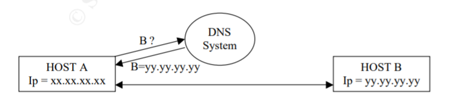

# DNS安全问题
## SANS InfoSec阅览室
- 本文来自SANS Institute阅览室网站。 未经明确书面许可，不得转发。

### DNS的安全问题
DNS对于黑客来说仍然是一个很好的目标。在世界范围内，BIND作为DNS服务器软件的普遍存在，黑客在接管服务器或仅仅使用DNS实现来重新定位流量时，都有可能出现的可能性，这些都是使DNS成为安全问题的根源。本文首先回顾了一些关于DNS工作原理的基本知识，然后介绍了黑客攻击DNS协议实现的不同方式，以使其发挥自己的优势。我们将关注…… 

## DNS安全问题 
### 文摘： 
- DNS对于黑客来说仍然是一个很好的目标。在世界范围内，BIND作为DNS服务器软件的普遍存在，黑客在接管服务器或仅仅使用DNS实现来重新定位流量时，都有可能出现的可能性，这些都是使DNS成为安全问题的根源。
- 本文首先回顾了一些关于DNS工作原理的基本知识，然后介绍了黑客攻击DNS协议实现的不同方式，以使其发挥自己的优势。我们将把重点放在我们所听到的所有词汇之间的关系上，而这些词通常是被误用的。最后，我们将通过解释一些应该用来防止这些问题出现的方法来回顾不同的服务器攻击和结束。

### 简介：
- 人类不能像电脑那样思考。他们只是不记得几十个IP地址。他们需要容易记住的名字来定位他们的邮件服务器或者他们最喜欢的网页。 为了使我们在互联网上轻松生活，因此就发明了DNS。随着它的到来，黑客们又有了一个新的地方用来娱乐。
- 此外，DNS的用途使它成为一个非常敏感的领域; 因为这是客户端连接定位的地方。黑帽子可以成功窃听DNS的可能性是巨大的(用户可以被定向到主机，由黑客控制，无论他使用什么服务:http、ftp、telnet…)。
一切皆有可能!
- 有两种方式可以攻击DNS：使用协议攻击（基于DNS实际工作的攻击）或使用服务器攻击（基于程序或运行DNS服务的程序或基于机器缺陷的攻击）。我们将看到这两种情况，以及如何保护它们，为什么我们应该担心。
- 但是首先，让我们尝试了解DNS的基本知识。

### A. DNS如何运作？
- DNS代表域名服务。总而言之，它的作用是将主机名转换为IP地址。 

- 互联网是一个IP网络。每一个主机都会受到一个IP地址的影响，这个IP地址必须被其他愿意交流的主机知道。但对于一个人来说，要记住它在互联网上使用的所有IP地址是不可能的。它可以在每个计算机本地创建IP地址和名称之间的映射。但是，鉴于网络上的计算机数量以及地址或名称的修改速度过快，这些表的更新将非常复杂且缓慢。 

- DNS提供了一种方法来了解Internet上任何主机的IP地址。它与其他目录服务没有什么不同。

- DNS也是一种分层服务。确实，一个名字有一个结构:它可以是server1.web.yahoo.com 或 pc12.lab25.univ-berlin.de

- 主机是这棵树上的叶子，任何其他的节点称为“域”（domain）。在我们的示例中，server1 是 “ web.yahoo.com ” 域中的主机之一。
- 我们需要服务器负责查找任何name-ip映射。当它们可以将IP地址映射到域中所有主机的主机名时，这些服务器被称为域的“权威”（authoritative）。
- 当主机请求映射时，搜索将从树的顶部开始向下。在我们的示例中，我们可能有一个用于univ-berlin.de域的DNS服务器，该服务器可能知道主机为:lab25.univ- berlin.de或该主机的权威DNS服务器lab22.univ-berlin.de级别，此主机的DNS服务器可能较低。在任何情况下，“.de”级别的DNS服务器将搜索定向到univ-berlin.de DNS，等。

- 参考1提供了更详细的DNS基础信息

#### 迭代和递归查询
- 在继续进行攻击之前，我们需要了解递归和迭代DNS查询之间的区别。
- 当主机查询一个DNS服务器时，它可以选择使用递归查询：在这种情况下，客户端需要答案，或者是一个错误信息，即它所寻找的信息在任何地方都找不到。我们可以看到，查询的主机必须做任何事情来找到答案：查询其他服务器，直到它获得信息，或者直到名称查询失败。
- 当主机以迭代的方式查询DNS服务器时，如果服务器知道它(如果它在缓存中有应答)，它就会请求服务器给出一个应答。如果没有，那么客户端将收到一个“referral”，这是一个服务器的名称，它可能有应答(我们讨论过的层次结构中较低层次的权威服务器)。

- 递归查询通常由客户端主机进行，这样它们就不必关心整个搜索过程，而本地DNS服务器通常会进行迭代请求。

- 参考2提供了一个小程序，用于演示这两种不同请求的特殊性。

### B、DNS：协议攻击
- 如前所述，DNS协议攻击是基于DNS协议实现的缺陷，即DNS在Internet上工作的实际方式。

- 当谈到DNS协议攻击时，我们经常会听到3个术语:
	- DNS欺骗（DNS spoofing）
	- DNS ID黑客攻击（DNS ID hacking）
	- DNS缓存中毒（DNS cache poisoning）
- 现在我们将解释它们各自的含义以及它们如何根据情况相互关联。

- DNS缓存中毒涉及到一个由DNS服务器缓存错误信息的攻击：通常错误记录会将一个名称映射到一个“错误的”IP地址。我们将会看到黑客有不同的方式来做这些，而且他们经常与DNS欺骗有关。随着DNS缓存中毒，黑客会尝试让DNS回答他想要的特定请求。例如，尝试让ns.defense.gov DNS来回答与黑客计算机的IP对telnetaccess.defense.gov IP的任何查询。

- 缓存中毒可以通过相关数据或不相关的数据攻击来完成(我们将在后面看到这些攻击)，以及使用DNS欺骗。

- DNS欺骗是一个术语，指的是响应针对另一个服务器（一个“真正的”DNS服务器）的DNS请求。这可以在服务器端交换（DNS服务器请求另一个映射）或在客户机-服务器对话框中（当客户端请求DNS服务器进行映射时）。没有功能性差异。黑客通过回答来“欺骗”DNS服务器，在数据包的源地址字段中应答DNS服务器的IP地址。

- 但这还不足以欺骗DNS的回复。DNS使用ID号来识别查询和应答，因此黑客需要找到客户正在等待的ID。为此，他将使用DNS ID 黑客攻击。使用DNS欺骗，黑客将尝试模拟DNS应答，以使请求的客户端被误导，但不涉及模拟DNS的DNS缓存。注意：如果请求客户端是另一个DNS服务器，那么它的缓存将被下毒，因此这将是一种缓存中毒的方法。
- 鉴于 “客户误导”这一事实（让一个客户端到他不愿意去的地方）通常是DNS黑客攻击的基本目的，那么我们最终会得出这样的结论:

- 我们已经定义了概念（缓存中毒、DNS欺骗和客户端误导）。现在我们将解释真正的攻击（相关和无关的数据攻击和DNS ID黑客攻击）是如何工作的。参考4和5将提供更多关于ID黑客攻击和缓存中毒攻击的信息。

#### 不相关数据攻击：

- 这是第一次攻击，最简单也是最广泛使用的:
	- 黑客在他控制DNS的域中询问受害者DNS是否存在一个不存在的名称映射。黑客使用“递归”查询，以便远程DNS服务器自己进行进一步查询。
	- 远程DNS不知道这样的映射，将会请求DNS服务器负责所需的域。记住这一点，这个服务器是在黑客的控制之下。
	- 黑客会应答，并添加任何他想要在受害者DNS缓存中缓存的答案。那样的话，他就会毒害远程DNS服务器的缓存。

	

- 这个问题已经在BIND中解决了，它禁止任何与原始请求无关的内容被缓存。

#### 相关数据的攻击：

- 攻击与不相关的数据攻击完全相同，但这一次黑客必须制作与原始查询相关的“额外”信息。他通过添加MX、CNAME或NS记录来解决这个问题，这些记录指向不相关的数据。我们可以在DNS数据库中找到的这三个记录并不是IP地址和主机名之间真正的“映射”。它们指向一些其他有用的信息(MX:域的邮件服务器，CNAME:别名的规范名称，NS:域的DNS服务器)。

- 因此，这些记录中的信息与原始请求“相关”，但它们可以指出黑客想要缓存的完全不同的信息。

- 这个问题在BIND中被修复了，它拒绝了所有的“out of zone”信息，也就是说，所有的信息都不完全和DNS负责的区域直接相关。

- 这两种攻击都很古老，在BIND上不再适用。的确，许多补丁自发现后就已经被释放。

- 然而，我们仍然听说DNS欺骗，通过DNS ID hacking技术。

#### DNS ID hacking

- 正如我之前解释的那样，DNS ID hacking是黑客成功模拟DNS服务器的必备技术(这是DNS欺骗的基础)。

- 事实上，为了能够伪造一个假的答案，黑客必须首先使用DNS服务器的IP地址作为他自己的IP数据包的来源，然后使用正确的ID号，否则客户端就不会考虑回复。

- 客户端将使用特定的ID号向DNS服务器发送查询。该服务器将使用相同的ID号进行应答。这是黑客必须找到的数字。

- 在局域网中，获取ID非常简单：黑客所要做的就是嗅探网络的初始查询，并比DNS(在局域网中很容易)更快地应答。来自真实DNS服务器的延迟回复将被丢弃。

- 当黑客与受害者客户端不在同一局域网时，他有四种选择：
	- 测试ID标记的所有可能值(或在NS回复之前的任意值)：这是一种过时而且毫无用处的方法，因为它唯一的优势是它会让你知道ID是什么。
	- 在DNS服务器上输入更多的时间来尝试不同的ID号。黑客甚至希望它会破坏服务器，使其崩溃。
	- 同时发送几百个回复以增加他找到好的ID的机会。黑客可以在不同的范围内完成多次，直到服务器回复。
	- 在服务器上使用一个漏洞，知道其中一些只是将ID号从一个请求增加到另一个请求。适用于服务器-服务器对话框（我们最后一个图中的“客户端”是一个DNS服务器，而黑客正在试图破坏它的缓存）。在这种情况下，黑客可以首先在黑客控制的区域内使用主机名向“客户端”发出请求，并嗅探受害者DNS服务器使用的ID。

	

- 这样，黑客就知道了受害者服务器当前使用的ID范围。他现在所要做的就是向主机名发出请求，他想要毒害我们的受害者的缓存，并使用被窃取的ID的增加值来伪造答案(使用多次答复将增加万一受害者很忙的可能性)

- 如果黑客不控制DNS，他仍然可以尝试一系列的随机ID，直到它迟到后停止(真正的DNS服务器回复)。如果黑客从受害者那里得到了答案，说这个地址是“yyy”，那么它就成功了。否则，这意味着太晚了，可以在另一个范围内尝试另一个查询。

- 注意：Windows95中存在一个漏洞，黑客很容易猜到这个ID: Windows默认使用1，如果其他查询直接跟随，则会递增。

- DNS服务器软件中的这种缺陷是协议攻击遇到服务器攻击的地方。

### C. DNS:服务器攻击

- 要详细说明这些攻击的细节是相当困难的。它们发展得太快了。一旦发现错误，就会释放补丁，反之亦然。

- 两种攻击可以针对服务器而不是DNS协议本身（参考.6）。
	- 攻击利用DNS软件实现中的错误(例如，BIND中的缓冲区溢出)或在其他正在运行的服务的DNS服务器的机器上（参考. 7）。
	- 通过拒绝服务攻击（例如，使用洪水，使用带内攻击的DNS服务，或者使用ICMP smurfing的机器）。

- 这里的建议是尽可能频繁地更新，并了解任何新发现的错误。许多站点（如www.securityfocus.com或www.cert.com）将对所有现有的bug、漏洞和修复进行编目；有些甚至专门用于BIND。

### D.相关性和如何保护?

- 大多数问题已通过补丁，BIND的新版本得到解决，但是根据menandmice.com网站称，威胁仍然存在:

- 本网站还有很多其他令人担忧的调查(参考文献3)。

- 我们经常听到许多关于DNSSEC的信息，这是一个关于安全DNS交易的提议。（RFC 2535:http://www.ietf.org/rfc/rfc2535.txt）。
这似乎是一个很好的解决方案，它解决了我们在本文中讨论的大多数协议问题。但是，由于向后兼容性的原因，这将不会在相当长一段时间内实现，当前的网络管理员应该考虑其他方法来保护他们的网络免受这些威胁。

- 为了获得DNS服务器或服务器组，需要做很多事情。参考文献8在这个问题上非常明确，并提供了在BIND上实现这些建议的方法。

- 我们可以引用其中的一些措施，特别是那些与我们在本文中看到的问题相匹配的措施:
	- 禁止递归查询以防止欺骗，
	- 尽可能多地更新BIND以限制bug问题，
	- 为了避免出现单点故障，不要将所有DNS服务器放在同一子网上，甚至在同一路由器或同一条专线后，
	- 限制可能的查询以及允许查询到最低限度的可能主机。

- 我们没有讨论区域转移，因为这是一种用来收集信息的方法，而不是真正的“破解”。发出特定的请求（AXFR），黑客可以检索DNS服务器数据库的全部内容。这通常用于将DNS辅助服务器与主服务器同步。这样，黑客就可以在受害者的网络上收集大量信息（主机数量、姓名、地址），并识别潜在的特定目标（如邮件、服务器、DNS等）。

- 当然，关闭此功能是一个好主意，或者至少将其限制在需要它的特定主机上。

- DNS架构的一个好主意是我们的“拆分服务”或“拆分DNS架构”。原则如下：我们将DNS系统拆分成两部分，一个负责宣传我们的名称到地址的映射，是权威的，另一个是解决来自内部的或者更一般的“受信任的”主机的请求。这样，如果外部DNS被入侵，至少不会影响到提供给内部主机的服务。

### E、结论：

- DNS不是新的，DNS入侵也已经存在一段时间了。破解DNS的技术越来越高，而且DNS无法使用进化的技术进行反击，因为它仍然需要保持向后兼容性。

- 这就是为什么在IPv6和它所承诺的所有相关的安全特性出现之前，我们必须继续修补我们的BIND版本。

### F、引用：

1. Stevens, Glenn. “The Domain Name Service”. June 21, 1995. URL: [http://eeunix.ee.usm.maine.edu/guides/dns/dns.html](http://eeunix.ee.usm.maine.edu/guides/dns/dns.html)
2. Kulapala, Beshan. “Recursive/Iterative Queries in DNS”. URL:[ http://wps.aw.com/wps/media/objects/221/227091/applets/dns/dns.html]( http://wps.aw.com/wps/media/objects/221/227091/applets/dns/dns.html)
3. “www.menandmice.com”. “DNS Surveys”. 2002. URL: [http://www.menandmice.com/6000/6000_domain_health.html](http://www.menandmice.com/6000/6000_domain_health.html)
4. “Gamma”. “DNS ID Prediction And Exploitation”. August 1998. URL: [http://c0vertl.tripod.com/text/dnsattack.txt](http://c0vertl.tripod.com/text/dnsattack.txt)
5. Erdfelt, Johannes. “Everything you ever wanted to know about DNS Spoofing”. July 25, 1997. URL: [http://www.the-project.org/admins/0897-1097/0381.html](http://www.the-project.org/admins/0897-1097/0381.html)
6. UK Security Online Ltd. “Hacker threat - DNS Server attacks”. 2002. URL: [http://www.uksecurityonline.com/threat/dns.php](http://www.uksecurityonline.com/threat/dns.php)
7. Carnegie Mellon University. “CERT Advisory CA-2001-02 Multiple Vulnerabilities in BIND”. Aug 2001. URL: [http://www.cert.org/advisories/CA-2001-02.html](http://www.cert.org/advisories/CA-2001-02.html)
8. Liu, Cricket. “Securing an Internet Name Server”. Feb 2001. URL: [http://www.linuxsecurity.com/resource_files/server_security/securing_an_internet_name_server.pdf](http://www.linuxsecurity.com/resource_files/server_security/securing_an_internet_name_server.pdf)